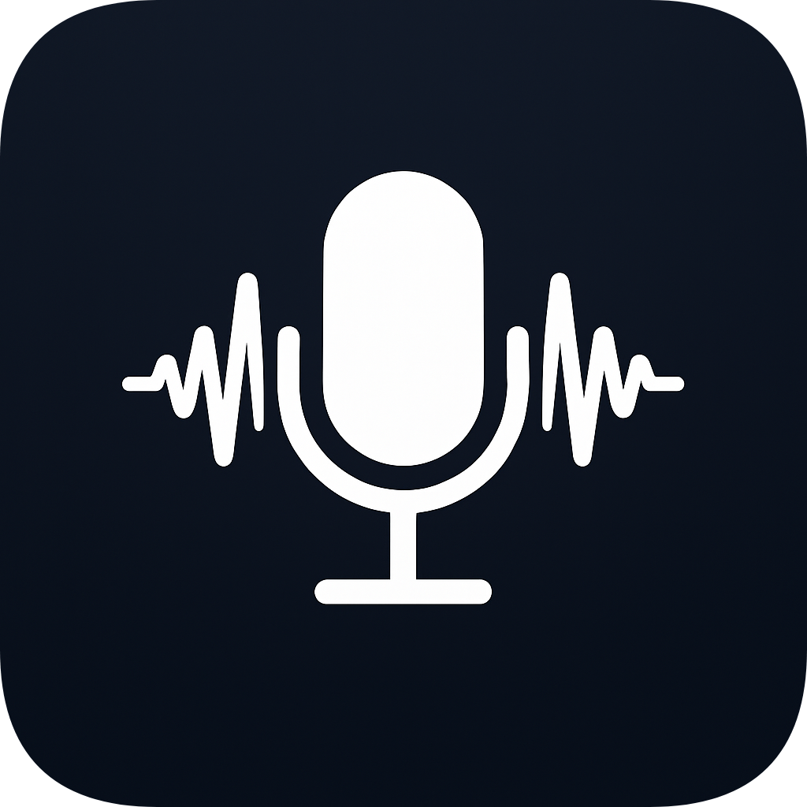
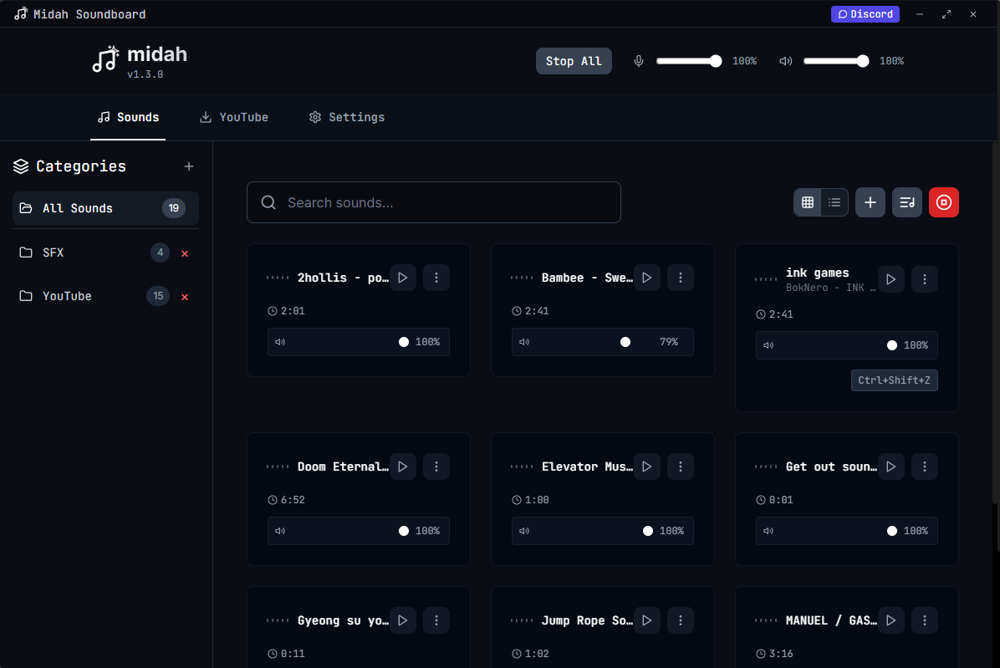
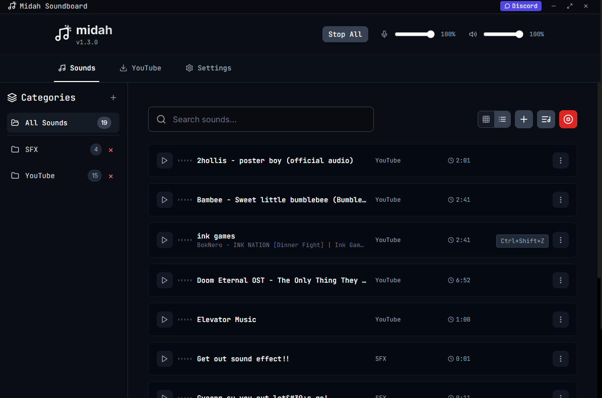
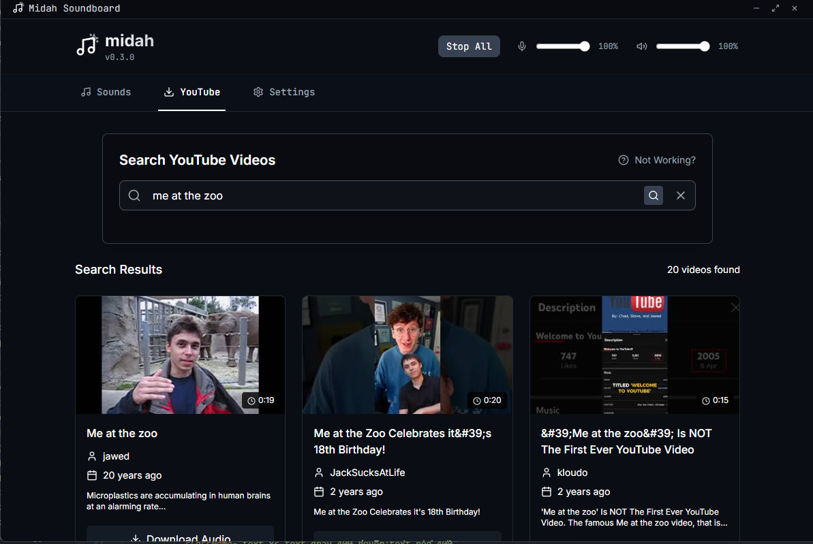

<h1 align="center">Midah</h1>
<h6 align="center">simple vb-cable soundboard with every sound imaginable</h6>

  

  <h3>  ^^^^^^^^ <b>press <a href="https://github.com/akramboussanni/midah/releases/latest">this</a> to download</b> ^^^^^^^^</h3>

### Support
Looking for help? Open an issue on the GitHub or join the [discord server!](https://discord.gg/9sj6EX8Usw)

### Core Features
- **Crossplatform**: Works natively on both Windows and [Linux](#linux)
- **Hyperoptimized**: Uses ~13mb of RAM, barely any CPU, and 8mb of storage.
- **Autoupdater**: You don't have to update everything yourself! Midah will look for new updates and prompt you to install them.
- **Hotkey System**: Play or stop sounds without even opening the app.
- **Sound Categorization**: Order your sounds with categories so your app doesn't stay messy.
- **Playback volume**: Set an output device to hear your own audios. Control output, playback and individual audio volume.
- **Local-only**: Play audio locally only and don't output it to your mic
- **VB-Cable Installer**: Midah requires VB-Cable or any virtual cable to work. It provides an installer for VB-Cable in the case that it is not present.
- **YouTube Integration**: Search and import audio directly from YouTube videos using `yt-dlp` and `ffmpeg`, which are automatically installed.

### User Interface

  
  
<em>Clean and intuitive interface for easy sound management</em>

  
  
<em>Alternative view if you prefer lists</em>

### YouTube Integration

  
  
<em>Search and import audio directly from YouTube videos</em>

---

### Linux
Support for Linux is now included in the app, including the updater. However, I am not supplying Linux build because nobody has requested it yet. If demand is there (if 1 person shoots me a DM or creates a GitHub issue) I will start testing this version and supplying builds.

### Requirements
Requires any sort of Virtual Audio implementation, yt-dlp and ffmpeg (autoinstalled), and a webview runtime (included with your OS)

### Building/Contributing
1. download the rust language
2. download the node latest version
3. clone project and open it
4. run `npm install`
5. run `npm run tauri dev` to test, run `npm run tauri build` to build
   
